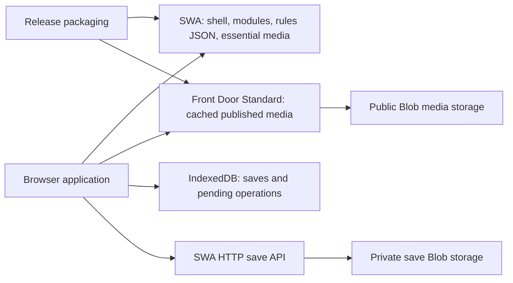

# Web delivery and storage architecture

Date: 2026-09-27. Status: **Approved for staged implementation; production cutover still requires player acceptance**.

## Decision

Retain Azure Static Web Apps (SWA) for the browser application and existing HTTP save API. Package a small, explicit SWA release containing the shell, gameplay data, and essential combat presentation. Publish the growing library of approved GLB models, large textures and long audio in a separate Azure Blob Storage account. For a public release serving players across regions, deliver those media files through **Azure Front Door Standard** with caching enabled. A limited pilot may use direct Blob URLs to avoid Front Door's fixed fee while the release workflow is established; that is a deployment stage, not the intended broad-audience delivery path. Do not move the application shell or private saves to the public media origin.

This choice follows from the browser-only game design and the art catalogue's growth. SWA already distributes application files globally, while its per-environment storage limit is 250 MB on Free or 500 MB on Standard. A separate media origin removes that release-size pressure; Front Door caches immutable media near players and handles a cold edge request by fetching from Blob. It does **not** make a cold download instant. Keep combat actions independent of media downloads, optimise exported assets, and prepare likely art before it is needed. Decoding, texture upload, shader preparation and memory pressure also affect readiness. [SWA overview](https://learn.microsoft.com/en-us/azure/static-web-apps/overview), [SWA quotas](https://learn.microsoft.com/en-us/azure/static-web-apps/quotas), [Blob with Front Door](https://learn.microsoft.com/en-us/azure/frontdoor/scenario-storage-blobs)

This is an expert recommendation rather than a claim of measured speed or a requirement to prove SWA/Blob performance parity. Check real player flows during implementation and adjust asset sizes and loading behaviour when they are poor; a hosting comparison is useful for diagnosis, not a prerequisite for choosing this architecture. Front Door Standard adds a profile base fee plus request and transfer charges, so estimate ongoing cost from expected traffic before enabling it for a public release. [Front Door billing](https://learn.microsoft.com/en-us/azure/frontdoor/billing)

This is a technical design and dependency sequence, not a replacement for the GitHub product roadmap. Scope and final player acceptance remain with the sponsor/Product Owner. No new numbered ADR is ratified here.

## Evidence and limits

Reviewed local working tree, including substantial uncommitted artwork and rendering work; it is not proof of the deployed application. A read-only Azure inventory confirms the current SWA is Free tier in West Europe and the existing private save account is Standard LRS with public Blob access disabled. The local package inventory is in [the release report](../reports/2026-09-27-web-release-inventory.md). Actual deployed release bytes, audience distribution, traffic and production timings remain unknown.

| Source | Verified implication |
| --- | --- |
| `.github/workflows/azure-static-web-apps-victorious-stone-02afeaa03.yml` | Publishes repository root, skips app build and removes selected development directories. An allowlisted release package is needed. |
| `staticwebapp.config.json` | Media access is currently same-origin; `/data/*` has one-hour caching. Global 404 override serves HTML with 200, which can conceal missing assets and fool HEAD checks. |
| `src/systems/AudioManager.js` | HEAD availability checks and automatic audio preloading exist; changing the hostname alone does not establish efficient loading. |
| `src/rendering/CombatArtAssets.js` | Encounter art configuration filters character models from combatants; model and GPU ownership already exist and should be extended rather than duplicated. |
| `src/ui/CombatSceneUI.js`, `src/rendering/CombatScene.js` | Refresh marks loading/busy before dynamic modules/config/models; that busy state disables actions through `main.js`. Existing scene readiness does not await all textures or GPU preparation. The 3D preview is currently optional/default-off and unavailable at narrow widths; do not assume it is the shipped mobile presentation. |
| `src/systems/saveStores/{LocalSaveStore,CloudSaveStore}.js` | LocalStorage slot keys are not identity scoped; local writes precede cloud upload; successful remote reads, including 404, bypass pending local state. No durable pending-sync protocol exists. |
| `api/src/functions/saves.js`, `api/src/store.js` | Five slots and 12 MiB request limit; slot data and index metadata are separate unconditional writes. Concurrent writes can lose index updates. |
| `src/systems/SaveManager.js`, `src/core/rulesEngine.js` | Serialization/store boundary exists, world saves omit regenerable tile data, and `RULES.saves.backend` currently defaults to local. Preserve those boundaries. |

Azure documents a per-environment limit of 250 MB Free / 500 MB Standard. The live SWA is Free tier; repository size is not deployed size. [SWA quotas](https://learn.microsoft.com/en-us/azure/static-web-apps/quotas)

Local audit of the evolving `data/combatScene.json` found 102 existing referenced files totalling about 431 MiB, including 79 model references totalling about 296 MiB. This is the catalogue, not one encounter's download or deployed production content. A traveller + wolf + woodland example is already approximately 11 MiB before ancillary assets: loading policy must account for actual encounter sets.

## Boundaries and minimum design



- SWA: HTML/CSS/JS, vendor modules, gameplay JSON, attribution, small essential/fallback visuals and required short sounds. Preserve the existing module architecture; no framework rewrite or bundler required solely for packaging.
- Media origin: approved exported GLB, image and long audio files selected by the release manifest, stored in Hot Blob storage and served through Front Door Standard for the public release. Front Door's media route caches public assets only; never route the private save API through that cache. Public media and private player saves use separate storage accounts to separate public access, CORS, lifecycle and operational blast radius. No recovery codes, storage keys or SAS credentials in the public media manifest.
- Authoring: `.blend`, source textures, alternate candidates, renders, prompts and generation outputs stay outside the release. Existing authoring files need not move immediately. Preserve required runtime exports and their licensing records.
- Save API: private authenticated-by-existing-identity HTTP continuity service, still accessed through `/api`; do not proxy bulk media through Functions.
- Local storage: IndexedDB for full saves and a durable sync queue. Browser HTTP cache for media initially. No service worker, custom persistent media cache, general asset platform or SQL database required for this scope.

The media-origin resolver is a transport concern. Content mappings remain data-driven in existing combat/audio JSON; gameplay rules and seeded generation must never depend on whether an asset has loaded. Runtime loading limits/timeout knobs belong in a small `RULES` delivery section. Build origins and deployment credentials belong in release configuration, not game rules or player save data.

## Release manifest and URL contract

Generate one manifest from approved runtime roots and existing content references. Use existing relative asset paths as keys to avoid creating a parallel content ID catalogue. Validate all references, including glTF external dependencies, dynamic path conventions, vendor modules and legal notices. Prefer self-contained GLB exports when already supported; do not silently rename glTF dependencies without rewriting them.

Illustrative generated schema (values are examples, not measured asset sizes):

```json
{
  "schemaVersion": 1,
  "releaseId": "git-commit-plus-build-id",
  "mediaBaseUrl": "https://media.example.invalid/releases/git-commit-plus-build-id/",
  "assets": {
    "data/graphics/combat/example.glb": {
      "location": "media",
      "path": "data/graphics/combat/example.glb",
      "bytes": 123456,
      "sha256": "build-generated-digest",
      "contentType": "model/gltf-binary"
    },
    "data/audio/example.ogg": {
      "location": "app",
      "path": "data/audio/example.ogg",
      "bytes": 1234,
      "sha256": "build-generated-digest",
      "contentType": "audio/ogg"
    }
  }
}
```

`location: app` resolves against the release's same-origin asset base; `media` resolves against the manifest's versioned Front Door media base in the public release. The first package and limited pilot may temporarily use same-origin or direct Blob URLs while the final route is prepared. Manifest validation rejects unknown locations, path traversal, duplicate keys and missing required references. Hashes support build/publish integrity checks; do not add a second runtime fetch solely to verify hashes.

Minimal proposed API: `resolveAsset(path): URL`; missing manifest entries are explicit errors, with a documented same-origin development mode. Keep `CombatArtAssets` responsible for loading/decoding and disposal. Add `prepareEncounter(combatants, { signal }): Promise<readiness>` at the presentation boundary using existing appearance/weapon/environment mappings. Audio uses the same resolver and manifest availability rather than HEAD probing. No new ability-specific branches.

## Loading and performance contract

1. Load the shell, rules and essential interface first. Preserve a playable essential presentation if optional media is unavailable; frontend/creative acceptance must confirm its clarity before it can be used as a release fallback.
2. During character selection and exploration, prefetch only a bounded likely set (party/common environment); never preload the entire bestiary. Derive candidates from existing public biome/catalogue context, without consuming gameplay RNG, rolling encounters early or revealing future encounter identity. Actual committed encounter roster determines its required set. Encounter selection and random outcomes must not change because of prefetch timing.
3. At the encounter transition, prepare required models, textures, effects, and short action sounds with bounded concurrency. Record transfer, parse/decode, GPU preparation and total ready time separately. Required readiness means playable presentation, not merely HTTP success.
4. Keep the current essential card presentation interactive while optional 3D prepares; separate asset-preparation state from action-animation busy state. Show preparation status and switch to prepared 3D only at an explicit/safe idle boundary, checking the current encounter generation. If future approved creative direction makes 3D mandatory, require a separately accepted bounded encounter-loading transition before that change. Do not hide a long first-combat stall behind background-loading terminology. Long music/voice can stream independently and must never block turn resolution.
5. After interactive readiness, **zero network dependencies for combat actions**. A missing optional sound is skipped; an unprepared visual uses the already-resident fallback. Do not replace actors or compile newly arrived models in the middle of an action. Late encounters/summons must obey the same fallback/readiness boundary.
6. Retain only a bounded working set. Reuse downloads via HTTP caching; establish measured ownership/disposal rules for decoded assets and GPU resources before introducing cross-scene caches. Existing disposal closes texture/ImageBitmap resources: sharing parsed GLTF objects without ownership changes would break reuse. Cancellation releases resources and prevents late completion attaching to a destroyed scene.

A media host cannot eliminate cold-download time: a 20 MiB encounter set at 10 Mbps requires roughly 17 seconds for transfer alone. Optimisation and bounded asset sets are prerequisites. Do not commit to new compression formats until vendor loader/decoder support, visual quality and decode cost have been tested on target browsers.

### Practical performance checks

The architecture does not require a controlled proof that Blob or Front Door matches SWA. The release still needs straightforward checks of the experience it actually delivers. A fallback that leaves combat playable is valuable, but it must not conceal a 3D view that rarely arrives.

- On a deployed preview, time shell-to-playable, encounter-to-interactive cards and encounter-to-ready 3D separately. Note how often the 3D view falls back or fails. Check a fresh visit and a repeat visit on a representative desktop and a mid-range phone, including a throttled connection. Phone acceptance covers its current card presentation; assess 3D on supported tablet/desktop widths. Do not expand 3D to widths at or below the current 767 px gate as a delivery side effect.
- Exercise representative small and large encounters at levels 1, 5 and 10. Use seeded exploration for repeatability. Inspect the slowest cases and the bytes, decode time and GPU preparation behind them; reduce the exported assets or change preparation timing if those waits feel disruptive. Size and responsiveness targets can be set from hands-on play once the target art is selected. Do not set a parity formula against an earlier, smaller art set.
- After an encounter is interactive, disconnect the media origin and confirm every combat action still resolves and presents intelligibly. A missing asset or slow response must produce a bounded retry/fallback without locking input. Navigation during preparation must cancel stale work.
- Check frame pacing, long tasks and memory across repeated encounters. Warm visits should reuse cached bytes; test cache eviction because a warm cache is not guaranteed. Decoded/GPU memory needs attention even when transfer sizes are small.
- Review Front Door cache behaviour and estimated monthly cost using realistic request and traffic volumes. If experience or cost is poor, first trim payloads and prefetch scope; then adjust edge policy or reconsider which assets belong on SWA. A direct Blob pilot is not evidence that the edge configuration is working.

## Deployment, caching and rollback

Build `dist/` from an explicit allowlist, not deletion of known unwanted folders. Include only the production entry points and transitively required runtime files. Preserve `LICENSE`, linked legal markdown and `legal/sbom/*.json`; do not blanket-exclude markdown. Development studies are excluded unless explicitly selected as a separate preview artifact; remove or deliberately route their existing menu links in the production entry point. Account for font references/CSP in the closure without broadly widening policy. Scan output filenames for forbidden secret/config files and authoring formats, validate references and record file counts/bytes; never read or print secret values for this check. Set the package budget below the verified tier limit with growth headroom (proposed 20%).

Publish immutable media under a unique release prefix, verify bytes/content types/CORS and representative real GETs, then publish the SWA artifact and its pinned manifest. Do not edit media under an existing release prefix. HTML and the release pointer revalidate; immutable release assets use long-lived cache headers. Version runtime JSON/modules consistently with their release, replacing `Date.now()` cache busting only after versioning is in place. A tab pins its manifest for its entire session; it must never fetch a mutable `latest` asset list mid-game.

SWA release packaging must support old open tabs: retain the prior release's versioned same-origin resources within budget, or explicitly test a safe save-and-refresh update flow. Do not assume Azure deployment swaps preserve removed paths. If retained app releases exceed package headroom, keep immutable non-shell resources at the media origin. Roll back the complete shell/config/manifest artifact to a retained release; keep its media available. Agree a supported open-tab/rollback retention window before automatic deletion. Storage lifecycle must not delete assets referenced by retained releases.

Configure correct MIME types and actual 404 responses for missing assets; navigation fallback applies only to navigation, not media/API requests. Test missing GLB/audio/vendor files as well as JSON. Blob CORS should allow required app/preview origins and GET/HEAD/OPTIONS, with exposed timing/cache headers as needed. CORS is browser access policy, not authorization. [Azure Blob CORS](https://learn.microsoft.com/en-us/rest/api/storageservices/cross-origin-resource-sharing--cors--support-for-the-azure-storage-services)

Extend CSP `connect-src`, `img-src`, and `media-src` for the selected host; add `blob:` only to directives demonstrably required by the existing loader. Keep script sources unchanged. Test cross-origin model textures, audio range requests, cache headers and `Timing-Allow-Origin` for useful Resource Timing. Preview builds must point to their own immutable media release and must not write production save data. Configure Front Door Standard's cache only for versioned public media paths and account for cold edge misses. Versioned immutable URLs avoid relying on frequent cache purges. [Front Door caching](https://learn.microsoft.com/en-us/azure/frontdoor/front-door-caching), [HTTP immutable caching](https://developer.mozilla.org/en-US/docs/Web/HTTP/Reference/Headers/Cache-Control)

## Save reliability contract

This proposes an ADR-017 amendment; preserve its serializer/store split, existing identity model and local rollback until separately accepted. Preserve ADR-011's tolerant old-save loading and prohibition on migration scripts.

Saving currently happens only when a player chooses a slot, and combat blocks saving. Cloud mode attempts upload on that explicit save; it has no durable retry queue today. The sync protocol below retries only snapshots already captured by a save action. Autosave frequency, safe points, slot policy and death/load semantics are an open product decision in [issue #50](https://github.com/KnowledgeRatio/nexus-verge-crpg/issues/50), to be resolved before broad cloud-save rollout [#38](https://github.com/KnowledgeRatio/nexus-verge-crpg/issues/38). Do not infer continuous saving from background sync.

### Local durable saves

Add `IndexedDbSaveStore` behind the existing async `getSlots/read/write/remove` boundary. Save, slot metadata and pending operation are written in one transaction. Lazily copy legacy localStorage records on read, validate a committed read-back, and retain originals until an explicitly accepted cleanup policy; never delete or rewrite them merely because IndexedDB opened. Legacy format handling is an adapter, not a standalone migration script.

Namespace all new records and pending operations by stable local identity namespace. Anonymous saves stay anonymous until the player explicitly imports/associates them. Switching player identity must not upload the previous identity's queue. Capture namespace and credentials at operation start; cancel or isolate in-flight work on identity change. Coordinate multiple tabs with IndexedDB transactions and conditional remote writes; a best-effort in-memory lock is insufficient.

The current client exposes a recovery code and username, but no stable public player identifier; rotating the code changes the server's derived storage key. Define an opaque client namespace that survives code rotation without placing the recovery code in IndexedDB keys, and test association on another device before enabling cloud sync. This is part of the identity-isolation work, not a reason to guess a namespace from the current credentials.

Rollback must preserve access to the newest progress. Retaining old localStorage originals alone is insufficient after IndexedDB-only writes, and larger saves may no longer fit there. The supported rollback build must retain a compatible IndexedDB reader/adapter and export/recovery path. If an older client cannot read the latest data, require upgrade or explicit recovery instead of silently loading an older slot. Test this before switching local storage defaults; do not promise a flag-only rollback.

Persist a per-slot operation identifier, local revision, base server ETag, pending state and save envelope. Deletion stores a durable tombstone; offline deletion cannot be undone by an older remote read. Queue processing resumes on application start, explicit retry and connectivity return, with bounded backoff/timeouts. Connectivity signals alone do not prove the API works.

Browser storage can be denied or evicted. Request persistence when appropriate, inspect quota and handle transaction failure explicitly. If local persistence fails, report failure honestly and offer export; an optional successful cloud write must say cloud-only. Never report locally durable success when the transaction failed. IndexedDB capacity is not infinite and does not fix synchronous serialization cost; measure main-thread save pauses and payload growth. [Browser storage quotas and eviction](https://developer.mozilla.org/en-US/docs/Web/API/Storage_API/Storage_quotas_and_eviction_criteria)

### Cloud consistency

Make one per-slot envelope authoritative: `{ schemaVersion, operationId, revision, metadata, save, deleted }`. Read/write it atomically as one Blob, using its ETag for `If-Match` and `If-None-Match` for initial creation. Derive slot listings from the five authoritative slot records, or treat any retained index strictly as a repairable cache; never rely on cross-blob atomicity. Legacy raw slots remain readable through an adapter. [Azure optimistic concurrency](https://learn.microsoft.com/en-us/azure/storage/blobs/concurrency-manage)

GET returns server revision/ETag; PUT/DELETE supplies the base ETag and operation ID. A repeated operation after a lost response is recognised as already applied if it is still current. A stale base returns an explicit conflict (HTTP 412), not a silent overwrite. Per-slot local revision checks ensure completion of an earlier upload cannot clear a newer pending save. Keep cloud tombstones or an equivalent versioned deletion record to stop stale devices recreating deleted slots silently.

Read arbitration: pending local save/tombstone wins over a stale remote response, including 404. Clean local records can refresh from server. Simultaneous changes preserve both copies and ask which progression to keep; do not merge gameplay state or rely on wall-clock timestamps for correctness. A conflict copy must survive reload independently of the ordinary slot limit. UI distinguishes saved on device, pending sync, synced, conflict, and failed.

Keep saves private, API responses `no-store`, and recovery credentials out of media requests and telemetry. Preserve the permanent `SAVE_TOKEN_SECRET` dependency. Verify backup/versioning retention and perform a restore drill before broad cloud enablement. Confirm practical API payload/rate limits and storage/transaction cost alerts using expected public traffic before enabling it broadly. Backend rollout must remain compatible with the previous client during the rollback window; either maintain old API semantics on an explicit legacy path or gate the new protocol by version. Do not let old unconditional writes bypass the new concurrency contract silently. Rollback readers must understand new slot envelopes/tombstones; otherwise require a version upgrade instead of returning malformed or stale saves.

Required failure matrix: quota denial, partial transaction failure, reload during save, offline write/read/delete/reconnect, remote 404 with pending local data, stale duplicate upload, two tabs, two devices, identity switch, expired request, server slot-list repair, conflict recovery, legacy import and rollback. Test realistic large worlds, all slots, Maps/plain restored characters, and export/import; preserve seeded world regeneration.

## Ordered implementation handoff

Sponsor sequencing decision, 2026-09-28: complete the reproducible asset-update
pipeline and web-delivery acceptance before moving the player-facing default to
cloud saves. Cloud-save design and the save-cadence decision may be prepared in
parallel, but cloud-save rollout is the next release phase after the web/media
workflow, not a side effect of switching the media origin. The public media
account and the private save account remain separate.

| Step | Owner and proposed files | Exit evidence |
| --- | --- | --- |
| 0. Size the release | Frontend + Architect; release inventory under `tools/`, short report under `docs/`; read-only Azure inventory through deployment owner | Actual published bytes, selected runtime references, live SWA tier, representative encounter pack sizes and a rough media traffic/cost estimate recorded. Recommendation stands; inventory sizes the work. |
| 1. Package current behaviour | Backend/build implementer; new `scripts/build-web.mjs`, package script, workflow and `staticwebapp.config.json` | Same playable flows from `dist`, no authoring/secrets/studies, legal files present, references valid, size headroom and real missing-asset 404. Keep current origin. |
| 2. Establish media contract and readiness | Frontend + data review; generated manifest/build validation, small resolver in `src/utils/`, existing `CombatArtAssets`, `CombatScene`, `CombatPresentation`, `AudioManager`, rules delivery config | Same-origin manifest works, actual roster feeds preparation, bounded concurrency/cancellation/disposal, action-time offline test passes. No remote production cutover. |
| 3. Finish the asset workflow and stage media delivery | Deployment owner + Frontend; versioned private source-art/export store, scoped CI identity, immutable public Blob releases, Front Door Standard media route, preview configuration and short playability report | A clean checkout can reproduce the app and selected media from approved versioned sources. Asset edits generate a new lock and prefix; CI verifies hashes, attribution, public responses and retention before app promotion. CORS/CSP/cache/MIME pass; cold and warm encounters remain playable with full-view readiness observed; cost estimate recorded. A direct Blob pilot may precede the public Front Door route. No provider-to-provider parity study required. |
| 4. Accept and cut over web delivery | Sponsor/Product Owner with Architect/Frontend evidence | Hands-on acceptance of loading and combat, realistic traffic/cost estimate, old-tab and rollback drills, then an explicit decision to switch the SWA release workflow. This completes web-delivery issue #53 before the cloud-save default changes. |
| 5. Establish local save durability | Backend + Frontend; `IndexedDbSaveStore`, SaveManager store selection, save UI, focused store tests | Lazy legacy copy retains originals, transactions/identity isolation/large saves/export verified. Local rollback retained per ADR-015. |
| 6. Establish cloud sync protocol | Backend + Frontend; `CloudSaveStore`, `api/src/store.js`, `api/src/functions/saves.js`, protocol tests and `docs/CLOUD_SAVES_SETUP.md` | Pending queue, ETags/idempotency/tombstones/conflicts, compatible rollout and restore drill pass failure matrix. No default flip yet. |
| 7. Accept and enable cloud saves | Sponsor/Product Owner with Backend/Frontend evidence | Save-cadence issue #50 is ruled and recorded. Two-device recovery, offline/reconnect, conflict handling, private-storage restore and rollback drills pass. Only then change `RULES.saves.backend` from local to cloud for the agreed audience; verify player-facing save status and old-save access. |

The save system is technically independent of the media host; the ordering above is the sponsor's release priority. Prepare #50 and protocol review before step 5 if useful, but do not turn on cloud saves merely because the web release has switched. Shared `rulesEngine.js` and `main.js` edits need coordinated ownership. ADR-015 requires characterization of the existing path before replacement and a human cutover decision; do not retire rollback automatically when tests pass.

For implementation run `npm test`, `npm run lint`, and `npm run lint:all` where build/config paths change; `npm run legal:verify` for release assets/attributions. Add meaningful contract/failure tests, not tests that only mirror manifest syntax. Browser playthroughs and measured delivery behaviour are required in addition to unit tests. Update `docs/DATA_SCHEMA.md` and cloud operations documentation with accepted contracts, and amend architecture rules only after the decisions are accepted.

## Unresolved facts before production cutover

Selected production artwork, audience geography, expected traffic, acceptable cold loading duration on constrained connections, live save-storage backup/versioning settings and preview identity isolation. These facts affect asset budgets, edge cost and rollout settings; they do not leave the hosting recommendation undecided.

Implementation has begun: the allowlisted package, generated media manifest and URL resolver, and optional 3D preparation path exist. A separate public-read-only media Blob account has been provisioned; Front Door has not. The current GitHub Actions workflow still deploys the repository root. A package built from the current worktree cannot be reproduced by CI while runtime modules and vendored files remain untracked. The package excludes local generated combat-audio candidates until their public-distribution rights are cleared; it selects the existing bundled sound fallbacks. Keep the current production delivery path until a versioned source, media publication, preview playthrough and cutover decision are ready. The Product Owner backlog tracks [web release #53](https://github.com/KnowledgeRatio/nexus-verge-crpg/issues/53), [generated-audio rights #54](https://github.com/KnowledgeRatio/nexus-verge-crpg/issues/54), [save-cadence decision #50](https://github.com/KnowledgeRatio/nexus-verge-crpg/issues/50) and [cloud save reliability #38](https://github.com/KnowledgeRatio/nexus-verge-crpg/issues/38).

Progress against the ordered handoff: step 0 has a local release and live-tier inventory, plus illustrative traffic/storage sizing. Step 1 now has an allowlisted package, reproducible content-hash media-lock generator (`npm run lock:web-media`), app-only build mode, local preview server and an opt-in CI package check; the production workflow has not switched, 32 required sources remain untracked, and browser acceptance is outstanding. Step 2 has a resolver, manifest, bounded model loading and card-first 3D preparation, but cancellation, preload policy and real encounter playthroughs remain. Step 3 has the dedicated public-read Blob account and all 107 locked assets published under an immutable release prefix; live HTTP checks passed for size, MIME, caching, missing-file 404 and SWA-origin CORS, including one anonymous full model GET. On 2026-09-29 the private source-art account, branch-bound GitHub OIDC identity and container-scoped RBAC in `deployment/media-source-pipeline.bicep` were deployed in the existing `nexus-verge` resource group, and the 107 approved exports (438.52 MiB) were archived in its private `approved-exports` container. The account denies anonymous Blob access and has 90-day soft deletion plus blob versioning. The opt-in promotion workflow is prepared but still requires committed files and GitHub repository variables; cross-origin browser testing and Front Door remain. Large art exports are untracked in Git, and editable sources have not been archived or independently backed up. Immutable public blobs and the checked-in lock preserve published releases but do not back up editable source art. Steps 4–7 have not been cut over. Local and cloud saves remain on their current defaults, and issue #50 must settle autosave semantics before that policy ships.
